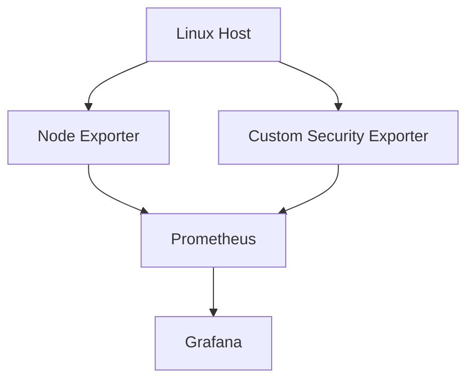
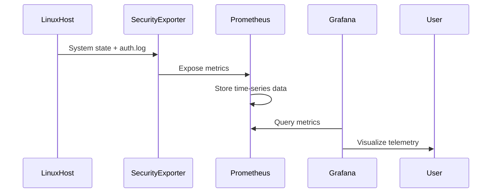
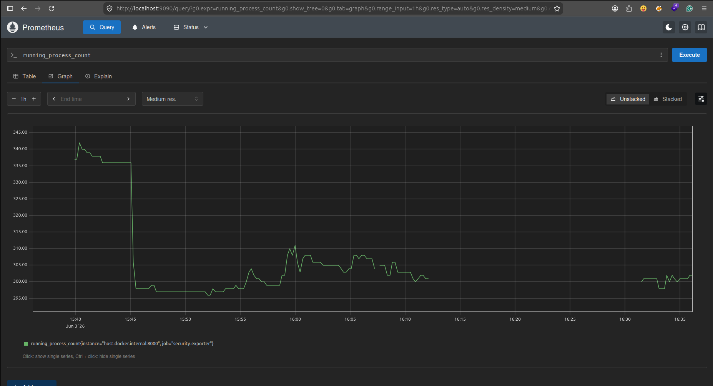
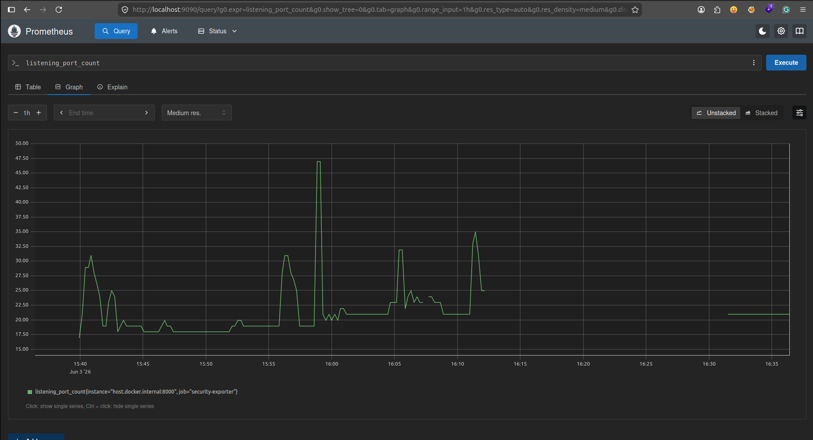

# Security Infrastructure Monitoring Stack

<p align="center">


</p>

<p align="center">
<b>Security-focused observability platform built using Prometheus, Grafana, Docker, Node Exporter, and a custom Python Security Exporter.</b>
</p>

---

# Overview

Modern infrastructure monitoring tools provide excellent visibility into CPU, memory, disk, and network health, but often lack lightweight security telemetry.

This project bridges that gap by combining traditional observability tooling with custom security-focused metrics exposed through a Prometheus exporter.

The result is a monitoring stack capable of visualizing both infrastructure health and basic security-relevant signals from a Linux host.

---

# Architecture



---

# Why This Project Exists

Traditional monitoring stacks answer questions such as:

* Is CPU utilization increasing?
* Is memory usage abnormal?
* Is disk space running out?

Security teams often need additional context:

* Are users logging into the system?
* Are suspicious SSH failures occurring?
* How many services are currently listening on the network?
* Has the process inventory changed unexpectedly?

This project introduces security telemetry into a standard observability workflow.

---

# Features

## Infrastructure Monitoring

* CPU Utilization
* Memory Utilization
* Disk Usage
* Network Traffic
* System Load
* Filesystem Statistics

## Security Telemetry

* Active User Session Tracking
* Running Process Inventory
* Listening Port Discovery
* Failed SSH Login Detection

## Visualization

* Grafana Dashboards
* Prometheus Query Interface
* Time-Series Metric Storage

---

# Project Architecture

## Components

| Component         | Purpose                        |
| ----------------- | ------------------------------ |
| Prometheus        | Metrics collection and storage |
| Grafana           | Dashboarding and visualization |
| Node Exporter     | Infrastructure metrics         |
| Security Exporter | Custom security telemetry      |
| Docker            | Service orchestration          |

---

# Metrics Catalog

## Infrastructure Metrics

Collected through Node Exporter.

| Metric Type | Description           |
| ----------- | --------------------- |
| CPU         | Processor utilization |
| Memory      | RAM consumption       |
| Disk        | Filesystem usage      |
| Network     | Interface traffic     |
| Load        | System load averages  |

---

## Security Metrics

Collected through the custom Python exporter.

| Metric                | Description                                             |
| --------------------- | ------------------------------------------------------- |
| active_user_sessions  | Number of currently logged-in users                     |
| running_process_count | Current process inventory size                          |
| listening_port_count  | Number of active listening ports                        |
| failed_ssh_logins     | Failed SSH authentication attempts detected in auth.log |

---

# Security Telemetry Pipeline



---

# Repository Structure

```text
security-infrastructure-monitoring-stack/
│
├── docker-compose.yml
│
├── exporter/
│   └── security_exporter.py
│
├── prometheus/
│   └── prometheus.yml
│
├── dashboards/
│
├── screenshots/
│
├── docs/
│
├── requirements.txt
│
└── README.md
```

---

# Installation

## Clone Repository

```bash
git clone https://github.com/apexajay-rc/security-infrastructure-monitoring-stack.git

cd security-infrastructure-monitoring-stack
```

---

## Create Python Environment

```bash
python3 -m venv venv

source venv/bin/activate
```

---

## Install Dependencies

```bash
pip install -r requirements.txt
```

---

## Start Infrastructure Stack

```bash
docker compose up -d
```

---

## Start Security Exporter

```bash
source venv/bin/activate

python exporter/security_exporter.py
```

---

# Configuration

## Grafana

Default URL:

```text
http://localhost:3000
```

Default credentials:

```text
admin
admin
```

---

## Prometheus

Default URL:

```text
http://localhost:9090
```

---

## Verify Targets

Navigate to:

```text
http://localhost:9090/targets
```

Expected:

```text
prometheus          UP
node-exporter       UP
security-exporter   UP
```

---

# Usage

## Prometheus Queries

Example:

```promql
active_user_sessions
```

```promql
running_process_count
```

```promql
listening_port_count
```

```promql
failed_ssh_logins
```

---

## Generate Failed SSH Events

```bash
ssh fakeuser@localhost
```

Enter invalid passwords multiple times.

The exporter will detect the events from:

```text
/var/log/auth.log
```

---

# Screenshots

## Monitoring Stack Health

Prometheus successfully scrapes all configured exporters.

<p align="center">
  
</p>

---

## Active User Session Monitoring

Tracks currently logged-in users on the monitored Linux host.

<p align="center">
  
</p>

---

## Running Process Monitoring

Monitors process inventory changes and system activity over time.

<p align="center">
  
</p>

---

## Listening Port Monitoring

Tracks active listening ports and service exposure on the host.

<p align="center">
  
</p>

---

## Failed SSH Login Detection

Custom security telemetry collected from Linux authentication logs.

This demonstrates the end-to-end flow:

SSH Failure → Auth Logs → Security Exporter → Prometheus → Visualization

<p align="center">
  
</p>

# Security Use Cases

## Brute Force Detection

Monitor repeated SSH authentication failures.

## Service Exposure Monitoring

Track changes in listening network ports.

## Process Inventory Monitoring

Observe fluctuations in running process counts.

## User Activity Visibility

Track active user sessions on monitored hosts.

---

# Technical Deep Dive

The Security Exporter periodically gathers system telemetry using:

* psutil
* Linux networking utilities
* Linux authentication logs

Metrics are exposed through:

```text
http://localhost:8000/metrics
```

Prometheus scrapes these endpoints at configured intervals and stores the resulting time-series data.

Grafana queries Prometheus and renders the information through interactive dashboards.

---

# Learning Outcomes

This project demonstrates practical experience with:

* Linux Systems
* Docker
* Prometheus
* Grafana
* Custom Exporter Development
* Security Monitoring Concepts
* Time-Series Telemetry
* Infrastructure Observability

---

# Roadmap

* [x] Prometheus Integration
* [x] Grafana Dashboards
* [x] Node Exporter Integration
* [x] Custom Security Exporter
* [x] Failed SSH Login Detection
* [ ] Alert Rules
* [ ] Alertmanager Integration
* [ ] Root Login Monitoring
* [ ] User Creation Detection
* [ ] Containerized Security Exporter
* [ ] Cloud Monitoring Integrations

---

# Contributing

Contributions, bug reports, and feature requests are welcome.

Please open an issue before submitting significant changes.

---

# License

Distributed under the MIT License.
